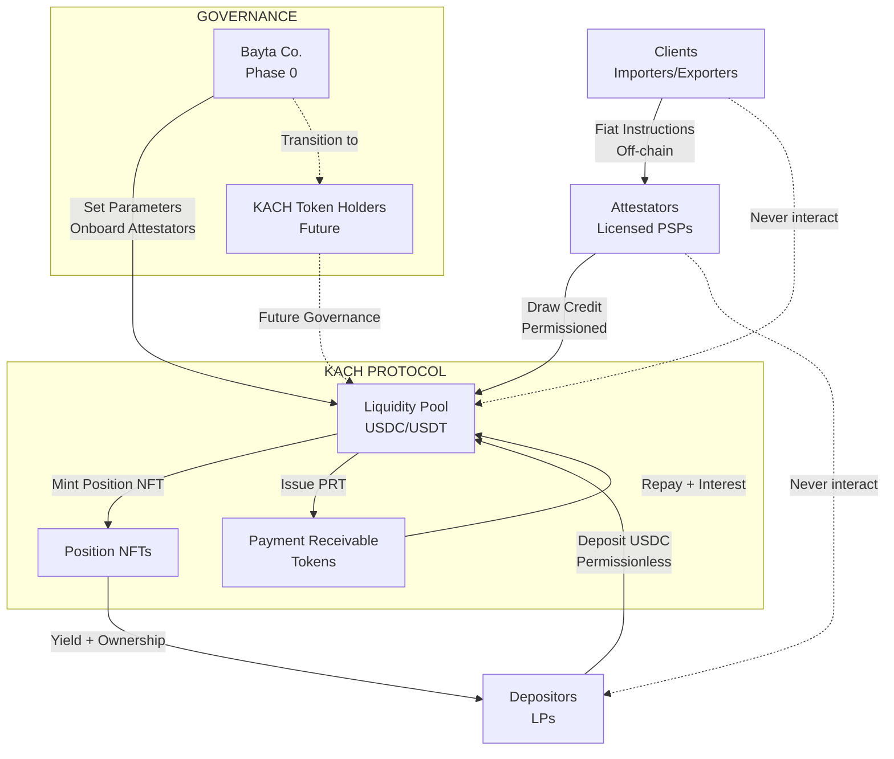

## Actor Ecosystem

**Key Relationships**:
- **Depositors ↔ Protocol**: Permissionless liquidity via Position NFTs
- **Clients ↔ Attestators**: Off-chain fiat relationships only
- **Attestators ↔ Protocol**: Permissioned credit via PRTs
- **Governance**: Bayta (now) → KACH token holders (future)

## Depositors (Liquidity Providers)

Depositors are:
- Crypto funds, family offices, and institutions.
- High-net-worth individuals comfortable with 3-24 month horizons.
- Crypto-native users who want real-world yield exposure rather than pure DeFi loop strategies.
- DAOs or treasuries seeking diversified stablecoin yield.

Depositing is **permissionless** at the protocol level, subject to any jurisdiction-specific restrictions that may be required in the future.

Depositors choose:
- **Lock-up profile**:
  - **Flexible**: withdrawable subject to liquidity and notice periods, lowest base yield.
  - **3 months**
  - **6 months**
  - **12 months**
  - **24 months**: highest base yield.
- **Risk [tranche](/glossary#tranche)** (see Tranches and Risk Layers):
  - **Senior**: Lower risk, lower yield, last-loss protection.
  - **Junior**: Higher risk, higher yield, first-loss exposure.

Yield comes from:
- Interest paid by Attestators.
- Protocol incentives (points, future KACH distributions).
- Any fee rebates or cross-protocol integrations over time.

**Tranche snapshot (illustrative)**

| Tranche | Commitment style | Illustrative APR\* | Loss absorption / notes |
| --- | --- | --- | --- |
| Senior | 6–18 month rolling commitments with 60–90 day notice | 8–14% | Last-loss capital; buffered by junior first-loss. Lower, steadier yield via dynamically calculated capital weighting. |
| Junior | 3–6 month evergreen, callable at term end | 14–22% | First-loss capital; highest yield via dynamically calculated capital weighting, takes initial defaults/timing shocks. |

\*Actual yields vary based on [utilization](/glossary#utilization), velocity, and dynamically calculated capital-weighted distribution. Multipliers are computed based on pool composition and base risk premium (typically resulting in junior earning 2-3× more per dollar than senior). Governance can adjust the base risk premium parameter per pool.

Each deposit mints a **[Position NFT](/glossary#position-nft)** that is the depositor's only claim on a pool. The NFT metadata tracks the stablecoin (USDC in most illustrations), [tranche](/glossary#tranche) selection, number of pool shares, lock-up duration, unlock timestamp, creation timestamp, and the current [NAV](/glossary#nav)/yield multiplier. Those fields drive yield, notice rules, and loss absorption. [Position NFTs](/glossary#position-nft) are transferable, so secondary-market buyers inherit the same lock-up, [tranche](/glossary#tranche) exposure, and redemption rights. Partial exits burn the original NFT and mint two with updated pro-rata attributes, while similar positions can merge. Unlocking requires burning the NFT; redemption proceeds always flow to the **current** NFT holder, not the original depositor.

## Clients (Fiat Originators)

Clients are:
- Importers, exporters, digital platforms, fintechs, treasuries, marketplaces, and any enterprise that must make real-world payouts.
- Off-chain entities that fund Attestators with fiat and never interact with Kach addresses or assets.
- Often concentrated in **Africa, Latin America, and [APAC](/glossary#apac)** corridors where FX frictions are high, but ultimately global.

Clients rely on Kach indirectly:
- They instruct their Attestator to fulfill payouts.
- They wire fiat (or local currency) directly to the Attestator.
- They receive settlement updates and proofs through the Attestator's reporting stack.

Clients can neither draw from Kach nor receive USDC from the protocol. Their only interface is their regulated Attestator, which shields them from on-chain complexity while keeping them outside Kach's risk perimeter.

## Attestators (Settlement Providers)

Attestators are:
- Regulated fintechs, remittance providers, cross-border [PSPs](/glossary#psp), and FX brokers with settlement capabilities.
- Initially focused on **Africa, Latin America, and [APAC](/glossary#apac)** payout corridors but legally registered in **US/EU** (or similarly enforceable) jurisdictions for credit agreements.
- The sole entities that appear on-chain and request or repay Kach credit.

Attestators use Kach credit lines to:
- Pre-fund supplier payouts in other jurisdictions while client fiat is still settling.
- Bridge timing gaps between local collections and FX conversions.
- Smooth liquidity during local currency squeezes without immobilizing balance sheets.

Attestators are **strictly permissioned**: they undergo [KYB](/glossary#kyb), underwriting, technical attestation integration, and a probationary period before limits scale.

**Attestator compliance checklist**

- Documented licenses/registrations in enforceable jurisdictions (e.g., US [MSB](/glossary#msb), EU [EMI](/glossary#emi), FCA-authorized [PSP](/glossary#psp)).
- Audited (or management-prepared) financials plus bank statements covering at least 12 months of volume.
- Live data connections to transaction monitoring/[AML](/glossary#aml) systems and proof of sanctions screening workflows.
- Sufficient equity and cash buffers, plus the ability to post guarantees where enforceable.
- Ability to sign and transmit cryptographic attestation payloads for every draw, referencing client fiat receipts and payout instructions.

## Operator: Bayta Co.

[Bayta Co.](/glossary#bayta) owns and operates the early-stage protocol infrastructure.

[Bayta](/glossary#bayta) runs or oversees:

- Off-chain underwriting and risk assessment led by **[Bayta](/glossary#bayta)'s credit team**, with locally licensed underwriting partners and automated intelligence feeds (Plaid, Sumsub, bank-data APIs) providing supporting diligence. [Bayta](/glossary#bayta) retains final approval authority so accountability sits in one place.
- Access control lists (ACLs) and Attestator limits.
- Integrations with KYC/[KYB](/glossary#kyb) providers (Sumsub, Plaid, etc.).
- Policy around corridors, counterparties, and risk appetite.

This blend keeps on-the-ground signals flowing in without diluting accountability: [Bayta](/glossary#bayta) retains final authority while local partners and automated monitoring ensure underwriting remains disciplined in each jurisdiction. Over time, [Bayta](/glossary#bayta)'s role evolves toward supervising decentralized committees rather than micromanaging day-to-day operations.

In the longer term, [Bayta](/glossary#bayta)'s role is expected to transition toward a holding structure with Kach operated from a jurisdiction such as BVI or Switzerland, and with a clearer separation between protocol governance and commercial operations.

## Governance: KACH Token Holders (Future)

- Kach remains tokenless at launch; a KACH governance/revenue-sharing token will only be proposed after the protocol meets performance KPIs (e.g., \>USD 250M cumulative settled volume, \<1% net loss ratio, independent audits).
- A non-transferable **points ledger** already tracks participation (deposits, lock-ups, [utilization](/glossary#utilization), referrals, tooling) but conveys no present economic rights; it simply provides data to inform any future allocation.
- Subject to governance approval, eventual token holders are expected to:
  - Approve interest-rate bands, [tranche](/glossary#tranche) buffers, and [utilization](/glossary#utilization) ceilings.
  - Adjust corridor and Attestator concentration caps.
  - Elect or ratify risk and underwriting committees.
  - Share in protocol revenue after reserves, operating costs, and any senior obligations are satisfied.
