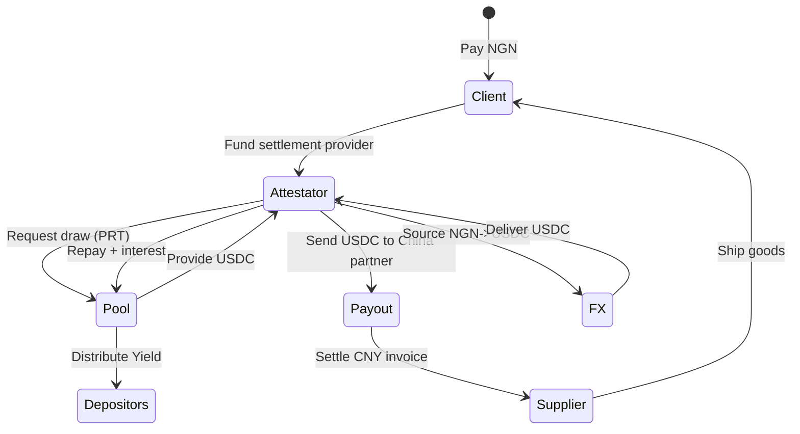

## Example Flow: Nohen's Payment

A mid-sized construction company, **Nohen**, needs to pay a supplier in China.

- Nohen holds **NGN** in Nigeria.
- They use a licensed cross-border payments partner for the international leg, which normally relies on stablecoins.

On a particular day:

- Local NGN liquidity is tight.
- The partner cannot immediately convert enough NGN into USDC at a fair rate.
- Waiting for liquidity would delay the payment and risk the supplier’s shipping window.

With Kach:

1. Nohen wires NGN to its settlement partner (the Attestator) and signs the payout instruction off-chain.
2. The Attestator requests a short-term credit draw from Kach within its limit and Trust Score.
3. Kach sends USDC from its Aptos pool to the Attestator’s address and mints a PRT that captures principal, tenor, rate, timestamps, the Attestator ID, and the attestation hash.
4. The Attestator forwards stablecoins to a Shenzhen payout partner, who pays the supplier in CNY.
5. Over the next 1–5 days, the Attestator sources USD by converting NGN through local liquidity providers.
6. Once conversion is done, the Attestator repays principal plus interest, closing the PRT.
7. Kach distributes yield to depositors based on their pool share and [tranche](/glossary#tranche); fees and reserves are recorded automatically.

Result:

- The supplier ships on time.
- The Attestator avoids parking a multi-million-dollar USD buffer.
- Depositors earn real-world, short-duration yield.
