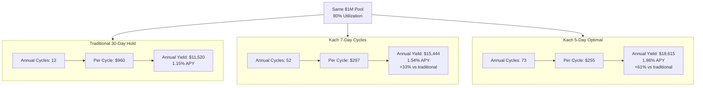

## Core idea

**KachFlow** is the credit engine that drives Kach: a **short-term, stablecoin-based lending system secured by real-world payment flows** designed specifically for those settlement cycles.

Key properties:

- Tenor: **Standard 1–5 days** for typical draws; prefund/extended draws select fixed 7, 14, 30, 60, or 90 days.
- Rate: **Fixed per tenor** (for example, 35 basis points for 7 days, 120 bps for 30 days).
- Selection: Borrowers choose tenor based on expected settlement time and cost optimization.

The insight is simple: **velocity compounds**. The same unit of stablecoin can be deployed multiple times per month if:

1.  Credit cycles are short,

2.  Attestators repay reliably, and

3.  The protocol can redeploy repayments immediately.

Unlike traditional credit systems that earn more when debtors pay late, Kach explicitly rewards early or on-time Attestator repayments with higher Trust Scores, lower per-cycle rates, and faster access to upgraded limits, aligning protocol efficiency with settlement-provider behavior.

Every draw also mints a **Payment Receivable Token (PRT)**. The token is non-transferable, held by the pool [contract](https://github.com/KachFlow/kach), and captures the draw's principal, rate, tenor, timestamp metadata, Attestator identifier, Trust Score snapshot, and attestation hash. PRTs accrue until repayment (or default), then burn to release realized yield to [tranche](/glossary#tranche)-specific [NAV](/glossary#nav) curves, keeping the on-chain ledger the canonical view of outstanding receivables.

## Example economics (illustrative)

Assume:

- Tenor: **1–5 days** standard (prefund example below uses **7 days** with **35 bps (0.35%)** interest).
- Full [utilization](/glossary#utilization) of capital for every cycle.
- Average actual repayment: **7 days** (on-time).

Then the implied annualized yield is:

- $$\frac{365}{7} \approx 52.1$$ cycles per year.
- Simple APY: $$0.0035 \times 52.1 \approx 18.2\%$$.
- Compounding APY: $$ (1 + 0.0035)^{52.1} - 1 \approx 19.8\% $$.

With the **prefund system** and faster-than-tenor repayments, actual cycles can be shorter:

- Average **5-6 days** to repayment → 60-73 cycles per year
- Higher utilization (80-85%) from capital availability
- Resulting APY: **20-25%** before protocol fees

**Why Velocity Matters**: The same capital deployed more frequently generates dramatically higher returns. Early repayment incentives and prefund mechanics enable 50-70+ cycles per year vs. traditional 12-cycle models.

For longer tenors, example **30 days at 120 bps**:

- $$\frac{365}{30} \approx 12.2$$ cycles per year.
- Simple APY: $$0.012 \times 12.2 \approx 14.6\%$$.
- Compounding APY: $$ (1 + 0.012)^{12.2} - 1 \approx 15.6\% $$.

In reality:

- [Utilization](/glossary#utilization) is less than 100%.
- Some liquidity must remain available for withdrawals.
- Attestator risk and operational constraints limit total exposure.
- [Tranche](/glossary#tranche) choices and lock-ups change the distribution of yield to LPs.

A realistic target band for depositors, under conservative assumptions, can be framed in the **high single to low double-digit APY range**, with upside when [utilization](/glossary#utilization) and performance allow, and downside if demand or repayment reliability weaken. Exact rates are subject to governance, pool performance, and risk constraints.

## Trust Score and Limits

Every Attestator (borrower) has a **Trust Score** that governs credit access and draw capabilities. The full hybrid model (amount- and count-weighted scoring, severity multipliers, recency decay, confidence scaling, anti-gaming sizing, and concave per-loan weighting) is documented in [Mechanics → Trust Score](/trust-score).

Thresholds remain:
- **≥ 60**: Eligible for standard PRT draws (with attestation)
- **≥ 95**: Eligible for prefund draws (no upfront attestation)
- **< 60**: Credit access suspended until score recovers

## Proof-of-Settlement Controls

Kach requires every Attestator to prove that fiat legs moved as instructed. The verification stack includes:

- **Signed payloads**: Each draw produces a structured payload (client instructions, fiat receipt references, timestamps) that the Attestator signs. The hash of this payload anchors into the corresponding PRT.
- **API integrations**: Bank, [PSP](/glossary#psp), and internal ledgers stream settlement updates into [Bayta](/glossary#bayta)'s risk tooling, which cross-checks them against attestation payloads before limits reopen.
- **Hash-committed logs**: Attestators maintain append-only logs of fiat receipts/payments whose Merkle roots or hashes are periodically published so tampering is detectable.
- **Audits and anomaly detection**: Periodic audits and automated monitors flag timing deviations, FX mismatches, or missing attestations for manual follow-up.
- **Kill switches**: Governance (initially [Bayta](/glossary#bayta)) can pause an Attestator's draw permissions immediately upon detecting misuse or failed attestations, isolating risk from the rest of the pool.

Need a detailed walkthrough? Read the standalone [Example Flow](/example) page for the NGN→CNY case study.
