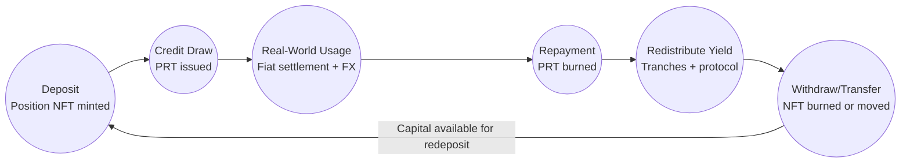

A typical lifecycle for deposited liquidity:

1.  **Deposit**

    -   A depositor selects the stablecoin they want to allocate (USDC at launch, more via governance) along with a [tranche](/glossary#tranche) (senior, mezzanine, junior) and a lock-up (flexible, 3, 6, 12, 24 months).

    -   The depositor sends the stablecoin to the pool. The [contract](https://github.com/KachFlow/kach) mints a [Position NFT](/glossary#position-nft) with the stablecoin id, [tranche](/glossary#tranche), shares, lock-up, NAV index, and timestamps.

    -   Deposit, NFT mint, and any split/merge events are emitted so off-chain ledgers can mirror activity exactly.

2.  **Credit draw**

    -   An approved Attestator initiates a draw within their limit and Trust Score constraints.

    -   The pool transfers the requested stablecoin and mints a non-transferable Payment Receivable Token (PRT) that encodes principal, rate, maturity, tenor, the Attestator id, a Trust Score snapshot, and hashes of fiat-side attestations.

3.  **Usage in real-world flows**

    -   The Attestator uses the stablecoins for cross-border payouts, FX operations, or settlement bridging.

    -   Fiat legs are managed by the Attestator and its licensed partners.

4.  **Repayment**

    -   Within 1-5 days (or the agreed longer term), the Attestator repays principal plus interest in the same stablecoin. The PRT is burned, and repayment events record realized yield or penalties.

    -   Late repayments impact Trust Score and may incur penalties that are stored against the PRT before it is closed out.

5.  **Redistribution**

    -   Interest is split into:

        -   [Tranche](/glossary#tranche)-adjusted depositor yield,

        -   Protocol fees (for operations, reserves, and future governance),

        -   Any incentive allocations (points, future KACH rewards).

    -   NAV and yield distribution reference NFT metadata so each position accrues exactly what its [tranche](/glossary#tranche), lock-up, and NAV index dictate. Repaid principal becomes available for the next credit cycle, subject to [tranche](/glossary#tranche) and lock-up constraints.

6.  **Withdrawal**

    -   [Position NFTs](/glossary#position-nft) that have passed their unlock timestamps can be burned to withdraw principal plus accrued yield, subject to liquidity safeguards.

    -   Flexible NFTs may still require notice periods, and early exits (if governance permits) can be handled by NFT splits plus secondary transfers instead of protocol-level penalties.

    -   The protocol manages buffers per pool to satisfy withdrawals while keeping enough liquidity for ongoing cycles.

7.  **Secondary transfers / restructuring**

    -   Because NFTs are transferable, holders can sell positions OTC or via marketplaces, with lock-ups and [tranche](/glossary#tranche) exposure enforced through metadata.

    -   Splits and merges help LPs rebalance, enabling partial exits or consolidated positions without redeeming in-protocol.

Robust event logs tie each of these steps together. Indexers replay deposit, NFT, PRT, and withdrawal events to rebuild balances without relying on proprietary databases, giving auditors and protocol governance shared, verifiable state.

**LP transparency commitments**

-   Real-time dashboards sourced from on-chain events publish [utilization](/glossary#utilization), Attestator concentration, and realized loss data per pool so depositors can independently monitor the credit book.

-   Periodic attestations (auditor-reviewed when feasible) reconcile NAV, cash balances, and outstanding PRTs, ensuring that passive LPs are never "flying blind" even though underwriting decisions are centralized.
