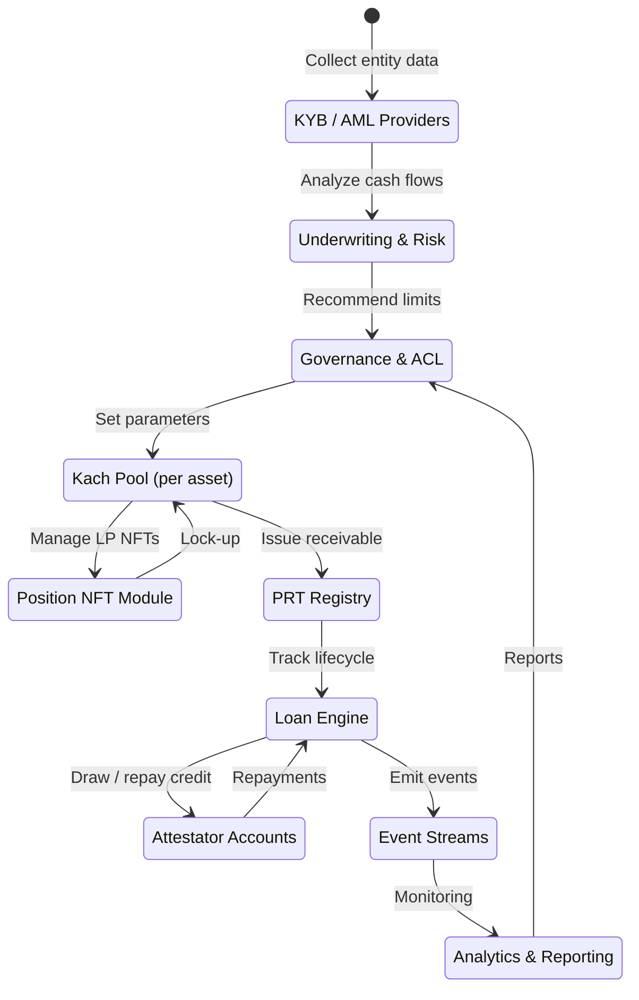

Kach runs as a collection of Move modules on Aptos backed by underwriting, compliance, and analytics services off-chain. Everything that touches assets, limits, or receivables stays on-chain; everything that touches identity or legal agreements stays in guarded systems.

## Architecture diagram

## On-chain components

- **Generic liquidity pool [contract](https://github.com/KachFlow/kach)**: One Move module manages every supported stablecoin. Governance registers each asset with its own [utilization](/glossary#utilization) caps, [tranche](/glossary#tranche) buffers, and [NAV](/glossary#nav) math. LPs see distinct pools (USDC, USDT, etc.) even though the code is shared.
- **[Position NFT](/glossary#position-nft) module**: Mints, tracks, splits, and merges depositor NFTs. Metadata embeds [tranche](/glossary#tranche), lock-up, share count, timestamps, and [NAV](/glossary#nav) index so redemption logic can key off a single object. Transfers are permissionless; the rules travel with the NFT.
- **Payment Receivable Token (PRT) registry**: Issues a non-transferable resource for each Attestator draw with principal, rate, tenor, maturity, Trust Score snapshots, and attestation hashes. Repayment burns the token, feeding realized yield back into pool accounting.
- **Event and accounting layer**: Emits structured events for deposits, NFT lifecycle actions, yield accrual snapshots, withdrawals, realized yield, and penalties. Off-chain systems replay these streams to rebuild balances exactly.
- **Loan engine & credit controls**: Enforces standard 1–5 day tenors for typical draws and fixed 7/14/30/60/90-day tenors for prefund/extended cases, rate schedules, and default waterfalls. Stores [utilization](/glossary#utilization) and Trust Score data while keeping limit parameters behind ACLs.
- **Access control**: An admin multisig can onboard or disable Attestators, adjust risk parameters, and trigger emergency pauses. Powers are scoped to prevent unilateral changes to depositor balances.

Everything is written in Move so assets behave like first-class resources, avoiding hidden approvals, ERC-20 style pitfalls, and other issues while keeping the path to formal verification straightforward when auditors request it.<a href="/references#ref-1">[1]</a>

## Off-chain components

- **[KYB](/glossary#kyb)/KYC and [AML](/glossary#aml)**: Providers such as Sumsub or Plaid handle identity verification, bank data access, and sanctions screening. Results feed into Attestator onboarding and periodic reviews.
- **Underwriting & risk reports**: [Bayta](/glossary#bayta)’s credit desk (with local partners where needed) reviews financial statements, bank flows, settlement data, and corridor-specific risk. Summaries are stored off-chain but referenced on-chain via identifiers or hashes.
- **Monitoring & analytics**: Attestator performance (repayment punctuality, utilization patterns, corridor concentration) is monitored continuously. Alerts feed into Trust Score adjustments and limit proposals.
- **Event ingestion**: Pool events stream into warehouses like ClickHouse so auditors, risk teams, or regulators can reconstruct the ledger without special RPC access.

## Cross-chain deposits

Kach’s canonical state lives on Aptos, yet LPs may fund from other ecosystems. The plan:

1. Accept deposits on other chains via approved stablecoins.
2. Route them through vetted bridges (for example zero-slippage native bridges such as Cashmere).<a href="/references#ref-2">[2]</a>
3. Keep all accounting and credit activity on Aptos so liquidity remains unified and traceable.
4. Allow withdrawals back over the same routes, with bridge-integrated swaps so LPs can arrive with whatever supported asset they already hold.

If a bridge shows signs of stress, governance can pause that intake without affecting on-chain credit operations.

## Tokenization summary

- **[Position NFTs](/glossary#position-nft)** capture every LP stake; metadata drives yield accrual, unlock timing, and loss participation. Splits and merges enable partial exits or consolidation without disrupting pool liquidity.
- **Payment Receivable Tokens** represent every Attestator draw from initiation through repayment or default. Because they include principal, tenor, rate, Trust Score, and attestation data, they are the canonical source for [NAV](/glossary#nav) and analytics.
- **Event streams** make the system replayable. Anyone with access to the events can reconstruct deposits, receivables, and withdrawals without privileged database reads.
