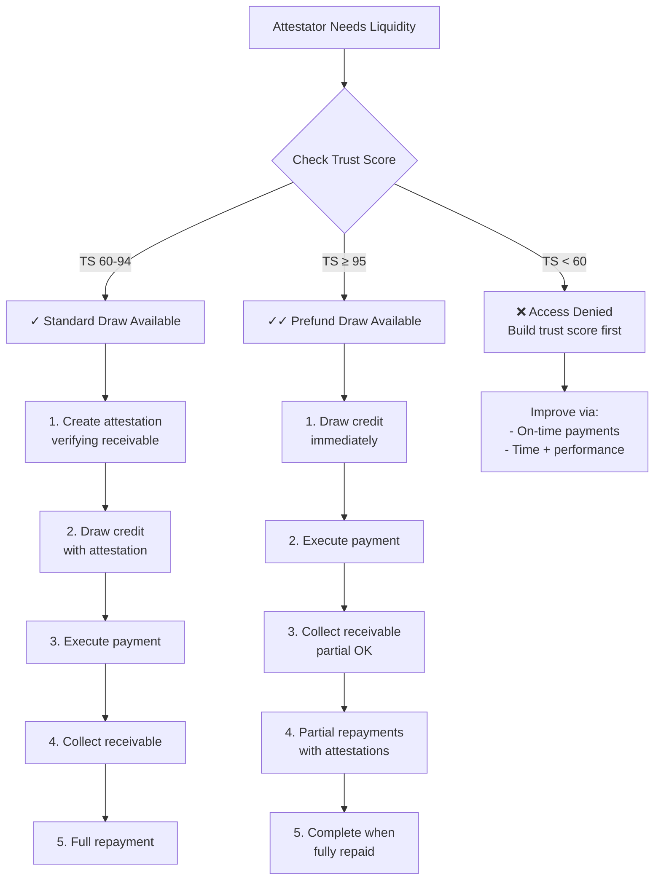

## Overview

**Attestators** are the licensed settlement providers who bridge Kach's on-chain liquidity with off-chain real-world payment flows. They are the only entities that can borrow from Kach pools, and they play a critical role in verifying that fiat settlements occur as expected.

Think of Attestators as regulated intermediaries who:
1. Verify off-chain receivables exist and are collectible
2. Draw on-chain credit to facilitate time-sensitive payments
3. Repay once receivables are collected

## Who Can Be an Attestator

### Regulatory Requirements

Attestators must be **licensed financial entities** in enforceable jurisdictions:

- **Money Service Businesses (MSB)** - US
- **Electronic Money Institutions (EMI)** - EU/UK
- **Payment Service Providers (PSP)** - Various jurisdictions
- **Foreign Exchange Brokers** - Licensed entities
- **Virtual Asset Service Providers (VASP)** - Regulated crypto exchanges
- **Licensed Remittance Providers** - Regional corridors

### Operational Requirements

1. **KYB Verification**: Complete Know-Your-Business screening
2. **AML Policies**: Demonstrated AML/CFT compliance programs
3. **Financial Health**: Minimum capital requirements and cash buffers
4. **Transaction Monitoring**: Systems to monitor and report suspicious activity
5. **Jurisdictional Presence**: Entity registered in US/EU or equivalent
6. **Technical Capability**: Ability to generate cryptographic attestations
7. **API Integration**: Connect to Kach's verification systems

## Registration Process

### Step 1: Off-Chain Application

Submit to Bayta (current operator):
- Corporate documents and licensing
- Financial statements (12+ months)
- Bank data connections (via Plaid or similar)
- AML/sanctions screening results (via Sumsub)
- Settlement history and references
- Supported corridors and receivable types

### Step 2: Underwriting Review

Bayta's credit desk analyzes:
- Entity creditworthiness
- Cash flow patterns
- Settlement track record
- Corridor-specific risk
- Operational capabilities
- Legal enforceability

### Step 3: On-Chain Registration

Admin calls:
```move
public entry fun register_attestator<FA>(
    admin: &signer,
    attestator_addr: address,
    supported_types: vector<String>
)
```

**Parameters**:
- `attestator_addr`: On-chain address for the Attestator
- `supported_types`: Receivable types they can attest (e.g., ["NGN_COLLECTION", "INVOICE", "TRADE_FINANCE"])

### Step 4: Credit Line Establishment

Admin creates credit line:
```move
public entry fun create_credit_line<FA>(
    admin: &signer,
    borrower: address,
    pool_addr: address,
    max_outstanding: u64,
    escrow_amount: u64,
    default_tenor_seconds: u64,
    default_interest_rate_bps: u64
)
```

**Credit Line Parameters**:
- `max_outstanding`: Maximum borrowing limit (e.g., $500,000)
- `escrow_amount`: Required collateral buffer (e.g., 5-15% of limit)
- `default_tenor_seconds`: Standard loan duration (e.g., 604800 = 7 days)
- `default_interest_rate_bps`: Default rate (e.g., 35 bps for 7-day tenor)

Initial limits are typically conservative (e.g., $100K-$500K) and increase based on performance.

## Supported Receivable Types

Attestators register specific receivable types they can verify:

### Common Types

**NGN_COLLECTION**:
- Nigerian Naira receivables
- Importer payments collected in Nigeria
- Verified via local bank APIs

**INVOICE**:
- Trade finance invoices
- B2B payment instructions
- Verified via invoice factoring systems

**TRADE_FINANCE**:
- Letters of credit
- Documentary collections
- Verified via SWIFT messages

**FX_SPOT**:
- Foreign exchange spot transactions
- Verified via FX broker confirmations

**REMITTANCE**:
- Personal remittance receivables
- Verified via remittance provider APIs

**ESCROW**:
- Funds held in escrow accounts
- Verified via escrow agent confirmations

Receivable types are extensible - new types can be added as corridors expand.

## Attestation Workflow

### Creating an Attestation

When an Attestator verifies an off-chain receivable, they create an on-chain attestation:

```move
public entry fun create_attestation<FA>(
    attestator: &signer,
    pool_addr: address,
    borrower: address,
    amount: u64,
    receivable_type: String,
    proof_hash: vector<u8>,
    metadata_uri: String,
    can_delegate_settlement: bool
)
```

**Parameters**:
- `pool_addr`: Which pool the credit will come from
- `borrower`: Who will draw the credit (can be attestator itself)
- `amount`: Amount of receivable verified
- `receivable_type`: Must be in attestator's supported types
- `proof_hash`: Cryptographic hash of off-chain proof documents
- `metadata_uri`: Link to detailed proof documentation

**Proof Hash Contents** (hashed off-chain):
- Client payment instructions
- Fiat receipt references or wire confirmations
- Bank API responses
- Timestamps of fiat movements
- Counterparty details
- Expected collection date

**Metadata URI** (IPFS or secure storage):
- Detailed settlement documentation
- Compliance records
- Communication logs
- Supporting evidence

### Attestation Object

The attestation creates an on-chain Object:

```move
struct Attestation<phantom FA> {
    attestator: address,
    pool_addr: address,
    borrower: address,
    amount: u64,
    receivable_type: String,
    proof_hash: vector<u8>,
    metadata_uri: String,
    can_delegate_settlement: bool,
    created_at: u64,
    used: bool,  // Becomes true when linked to PRT
    revoked: bool
}
```

### Using an Attestation

Borrower uses the attestation to draw credit:

```move
public entry fun draw_credit_standard<FA>(
    borrower: &signer,
    pool_addr: address,
    attestation_addr: address,
    tenor_seconds: u64,
    metadata_uri: String
)
```

This:
1. Verifies attestation is valid and unused
2. Checks borrower's credit line and trust score
3. Creates PRT linked to attestation
4. Transfers stablecoins to borrower
5. Marks attestation as used

### Revoking an Attestation

If an attestation was created in error or circumstances changed:

```move
public entry fun revoke_attestation<FA>(
    attestator: &signer,
    attestation_addr: address
)
```

**Rules**:
- Can only revoke if not yet used in a PRT
- Once linked to PRT, cannot be revoked
- Revocation increments reputation counter (revocation_count)
- Excessive revocations may indicate poor process quality

## Drawing Credit

Attestators have two methods to draw credit, determined by Trust Score:



### Method 1: Standard Draw (Trust Score ≥ 60)

**Workflow**:
1. Create attestation verifying receivable
2. Draw credit using attestation
3. Execute real-world payment
4. Collect receivable off-chain
5. Repay on-chain

**Use Case**: Standard operations, proven receivables

### Method 2: Prefund Draw (Trust Score ≥ 95)

**Workflow**:
1. Draw credit immediately (no upfront attestation)
2. Execute real-world payment
3. Collect receivable off-chain (can be partial)
4. Make partial repayments with attestations
5. Complete when fully repaid

**Use Case**: Time-sensitive payments, high-trust Attestators

See [Prefund PRT System](/prefund-prt) for complete details.

## Repayment Operations

### Standard Repayment

Full repayment of a PRT:

```move
public entry fun repay_prt<FA>(
    borrower: &signer,
    prt_addr: address
)
```

Transfers:
- Principal amount
- Accrued interest (based on tenor and rate)
- Both go to pool for distribution

Results:
- PRT burned
- Trust score +1 (on-time) or -5 (late)
- Credit line headroom reopens

### Partial Repayment (Prefund Only)

For prefund PRTs:

```move
public entry fun repay_prefund_prt_partial<FA>(
    borrower: &signer,
    prt_addr: address,
    amount: u64,
    proof_hash: vector<u8>,
    attestator_addr: address
)
```

Each partial repayment requires:
- Amount being repaid
- Attestation proof for this portion
- Reference to attesting Attestator

Interest calculated time-weighted based on outstanding principal and days elapsed.


## Reputation System

Attestators build on-chain reputation tracked in the registry:

```move
struct AttestatorReputation {
    attestation_count: u64,     // Total attestations created
    default_count: u64,         // Loans that defaulted
    revocation_count: u64       // Attestations revoked
}
```

### Key Metrics

**Attestation Count**:
- Increments with each attestation created
- Demonstrates activity level
- Higher count = more experience

**Default Count**:
- Loans that went to default
- Indicates credit quality of receivables attested
- High defaults = poor attestation quality

**Revocation Count**:
- Attestations revoked before use
- Occasional is normal; frequent indicates poor process
- High revocations = quality concerns

### Reputation Ratios

**Default Ratio**: `default_count / attestation_count`
- Excellent: &lt;1% (strong attestation quality)
- Acceptable: 1-5% (normal credit risk)
- Poor: >5% (weak credit assessment)

**Revocation Ratio**: `revocation_count / attestation_count`
- Good: &lt;2% (clean process)
- Acceptable: 2-5% (some errors)
- Poor: >5% (process quality issues)

## Slashing Mechanism

## Trust Score Impact

Attestator operations directly impact the borrower trust score:

| Action | Trust Score Impact |
|--------|-------------------|
| On-time repayment | +1 |
| Late repayment | -5 |
| Default | -20 |

**Trust Score Thresholds**:
- **≥ 95**: Prefund draw access (no upfront attestation)
- **≥ 60**: Standard draw access
- **< 60**: Credit access suspended

Building from 60 to 95 typically requires:
- 35+ consecutive on-time payments, or
- Mix of on-time payments offsetting earlier lates
- Sustained performance over multiple months

## Operational Best Practices

### For Attestators

**Credit Assessment**:
1. Verify receivable exists before attesting
2. Confirm counterparty creditworthiness
3. Validate payment instruction authenticity
4. Check for FX or jurisdictional risks
5. Size attestations to proven collection capacity

**Attestation Quality**:
1. Generate strong proof hashes (SHA-256 or better)
2. Store proof documents securely (IPFS, encrypted storage)
3. Link to verifiable external data sources
4. Document all verification steps
5. Maintain audit trail

**Timing Management**:
1. Select tenor based on realistic collection timeline
2. Build buffer for delays (weekend, holidays)
3. Monitor maturity dates actively
4. Ensure timely repayment to maintain trust score
5. Communicate with borrowers on timing

**Risk Management**:
1. Diversify across corridors and clients
2. Monitor concentration risk
3. Track default ratio and repayment patterns
4. Reserve capital for timely repayments

## Monitoring and Dashboards

### Real-Time Metrics

Attestators should monitor:
- **Active PRTs**: Outstanding loans by amount and maturity
- **Utilization**: Current draw / max credit line
- **Trust Score**: Current score and trend
- **Upcoming Maturities**: PRTs maturing in next 24-72 hours
- **Reputation Metrics**: Attestation, default, and revocation counts

### Performance Analytics

- **Average tenor**: Actual vs. requested
- **Repayment timing**: Distribution of early/on-time/late
- **Default rate**: Defaults / total loans
- **Interest earned by protocol**: Contribution to LP yields
- **Velocity**: Average days from draw to repayment

### Alerts

- PRT maturity approaching (24-hour warning)
- Trust score dropped below threshold
- Credit line utilization > 80%
- Reputation ratio outlier detected

## Revenue Model

Attestators earn through:

1. **Client Fees** (Off-chain):
   - Service fees charged to clients for payment facilitation
   - Typical: 50-200 bps of payment amount
   - Varies by corridor and service level

2. **Yield Arbitrage**:
   - Borrow at protocol rate (35-320 bps)
   - Charge clients higher rate
   - Spread = revenue

**Example Economics**:
- Client needs $100,000 payment (NGN corridor)
- Client pays 150 bps fee → $1,500 to Attestator
- Attestator borrows at 120 bps (30 days) → $1,200 cost
- Net revenue: $300 per transaction
- At 10 transactions/month: $3,000/month revenue

## Future Enhancements

**Planned Features**:
1. **Reputation NFTs**: Transferable attestator reputation tokens
2. **Automated Attestations**: API-driven attestation creation
3. **Batch Operations**: Attest and draw multiple in single tx
4. **Dynamic Limits**: Auto-adjust based on performance
5. **Cross-Chain Attestations**: Accept attestations from other chains
6. **ZK Attestations**: Private attestations with zero-knowledge proofs

**Under Research**:
- Oracle integration for real-time fiat settlement verification
- Decentralized attestator network (DAO-based approval)
- Automated credit line increases based on ML models
- Flash loan style attestations for instant settlement

## Related Documentation

- [Prefund PRT System](/prefund-prt): Advanced credit without upfront attestation
- [KachFlow Credit Engine](/kachflow): Core credit mechanics
- [Compliance](/compliance): Regulatory requirements
