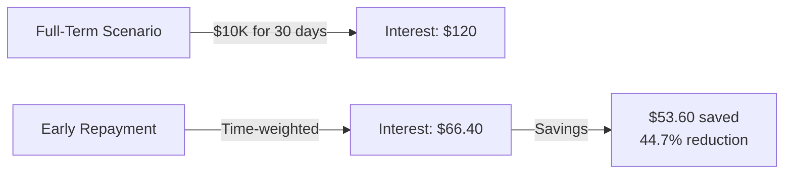
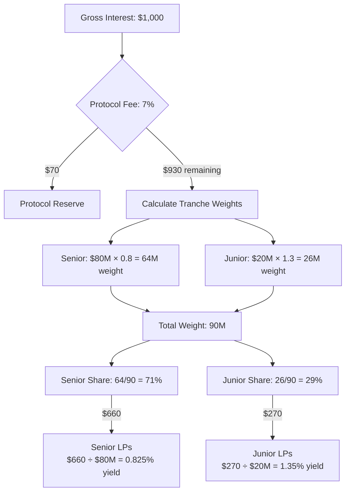

## Overview

Kach uses a **fixed tenor-based interest rate model** where rates are predetermined for specific loan durations. Standard draws typically run **1–5 days**; prefund/extended draws select from fixed 7/14/30/60/90-day tenors. Unlike dynamic rate models that adjust based on utilization, Kach's rates are fixed by tenor selection, providing predictability for both borrowers and liquidity providers.

### Standard Draw Rates (1–5 days)
- Flat rate: **20 bps** (0.20%) applied to the principal for standard 1–5 day draws.
- Early repayment reduces actual cost via velocity; penalties still apply to late/defaulted PRTs.

This model is optimized for short-term cross-border settlement credit where:
- Borrowers need predictable costs for planning
- Fast repayment cycles create yield through velocity
- Time-weighted calculations reward early repayment
- Simplicity reduces operational complexity

## Tenor Options and Rates

Kach offers **five fixed tenor options** with corresponding interest rates for prefund/extended draws (standard draws generally settle in 1–5 days):

| Tenor | Duration (seconds) | Duration (days) | Rate (bps) | Rate (%) | Annualized APR* |
|-------|-------------------|-----------------|------------|----------|-----------------|
| **7 days** | 604,800 | 7 | 35 | 0.35% | ~18.9% |
| **14 days** | 1,209,600 | 14 | 60 | 0.60% | ~16.4% |
| **30 days** | 2,592,000 | 30 | 120 | 1.20% | ~15.2% |
| **60 days** | 5,184,000 | 60 | 220 | 2.20% | ~13.7% |
| **90 days** | 7,776,000 | 90 | 320 | 3.20% | ~13.4% |

_*Annualized APR assumes full utilization through all cycles in a year: (1 + rate)^(365/days) - 1_

## Rate Selection Logic

### Choosing a Tenor

Borrowers (Attestators) select tenor based on:

1. **Expected Settlement Time**:
   - NGN corridor: Typically 3-7 days → Choose 7-day tenor
   - BRL corridor: Often 10-14 days → Choose 14-day tenor
   - Trade finance: 30-60 days → Choose 30 or 60-day tenor

2. **Cost Optimization**:
   - Shorter tenors have better annualized rates
   - But must repay faster
   - Balance cost vs. timing certainty

3. **Risk Buffer**:
   - Add buffer for unexpected delays
   - Better to overshoot and repay early (no penalty)
   - Than undershoot and pay late (trust score penalty)

4. **Trust Score Requirements**:
   - Standard draws (TS ≥ 60): Any tenor available
   - Prefund draws (TS ≥ 95): Any tenor available
   - Lower trust scores may be restricted to shorter tenors

### Rate Rationale

**Why Fixed Rates?**
- **Predictability**: Borrowers know exact cost upfront
- **Simplicity**: No complex utilization tracking
- **Transparency**: LPs know expected yield profile
- **Operational Efficiency**: Easier accounting and reconciliation

**Why These Specific Rates?**
- **Competitive**: vs. traditional trade finance (5-15% APR)
- **Risk-Adjusted**: Short tenors = lower default risk = lower rates
- **Volume-Optimized**: Encourages rapid cycling for velocity
- **LP Attractive**: Annualized yields competitive with DeFi (10-20% APY)

## Interest Calculations

### Standard PRT Interest

For standard PRTs (single repayment), interest is calculated simply:

```move
interest = principal × rate_bps / 10000
```

**Example**:
- Principal: $50,000 USDC
- Tenor: 30 days (120 bps)
- Interest: $50,000 × 120 / 10,000 = **$600 USDC**
- Total repayment: $50,600 USDC

This interest is due regardless of when repayment occurs (early or on-time), as long as it's before maturity.

### Time-Weighted Interest (Prefund PRTs)

For prefund PRTs with partial repayments, interest is calculated based on **actual days each principal amount was outstanding**:

```move
interest = outstanding_principal × rate_bps × (days_elapsed / total_tenor_days) / 10000
```

**Visual Timeline**:

```mermaid
gantt
    title Prefund PRT Repayment Timeline (30-day tenor, 120 bps)
    dateFormat X
    axisFormat Day %L

    section Principal Outstanding
    $10,000 outstanding    :0, 10
    $5,000 outstanding     :10, 20
    $2,000 outstanding     :20, 28
    Fully repaid          :28, 30

    section Repayments
    Repay $5,000 + $40 int :milestone, 10, 0
    Repay $3,000 + $20 int :milestone, 20, 0
    Repay $2,000 + $6.40 int :milestone, 28, 0
```



**Example Scenario**:

**Loan Details**:
- Principal: $10,000 USDC
- Tenor: 30 days
- Rate: 120 bps (1.20%)
- Full-term interest would be: $120 USDC

**Repayment Schedule**:

**Period 1: Day 0-10**
- Outstanding: $10,000
- Days: 10
- Interest: $10,000 × 120 × (10/30) / 10,000 = **$40**
- Repayment on Day 10: $5,000 principal + $40 interest

**Period 2: Day 10-20**
- Outstanding: $5,000 (after $5,000 repaid)
- Days: 10
- Interest: $5,000 × 120 × (10/30) / 10,000 = **$20**
- Repayment on Day 20: $3,000 principal + $20 interest

**Period 3: Day 20-28**
- Outstanding: $2,000 (after $8,000 total repaid)
- Days: 8
- Interest: $2,000 × 120 × (8/30) / 10,000 = **$6.40**
- Final repayment on Day 28: $2,000 principal + $6.40 interest

**Total Interest Paid**: $40 + $20 + $6.40 = **$66.40**

**Interest Saved**: $120 - $66.40 = **$53.60** (44.7% savings)



This rewards borrowers for repaying principal early, reducing the capital tied up and allowing the pool to redeploy faster.

## Early Repayment Incentive

To further encourage fast repayment, Kach offers a **200 basis point (2%) bonus** on interest saved through early repayment, implemented as a 1.02× multiplier on the interest that would have accrued if funds stayed out for the remaining days:

### Calculation

```move
saved_interest = full_term_interest - actual_interest_paid
early_repayment_bonus = saved_interest × 1.02  // saved interest plus a 2% kicker
net_interest = actual_interest_paid - early_repayment_bonus
```

### Example with Bonus

Using the prefund example above:

- Full-term interest: $120.00
- Actual interest (before bonus): $66.40
- Interest saved: $53.60
- Early repayment discount (saved interest × 1.02): $53.60 × 1.02 = **$54.67**
- **Net interest charged**: $66.40 - $54.67 = **$11.73**

Because the current implementation discounts more than the saved interest, aggressively early repayments can drive net interest close to zero; governance can tune this via `EARLY_REPAYMENT_DISCOUNT_BPS`.

### Bonus Rationale

**Why Offer This Bonus?**

1. **Capital Velocity**: Faster repayment = more cycles = higher overall yield for LPs
2. **Risk Reduction**: Less time outstanding = lower default risk
3. **Behavioral Incentive**: Makes early repayment economically attractive
4. **Competitive Advantage**: Unique feature vs. traditional lenders
5. **System Health**: Encourages healthy cash flow patterns

**Cost to Protocol**:
- Bonus paid from protocol interest share (currently 7% fee)
- Net positive if repayment velocity increases
- Expected: Bonus costs < gains from additional cycles

## Interest Distribution

When interest is received, it's distributed according to the tranche waterfall:

### Distribution Waterfall



1. **Protocol Fee**: 7% of gross interest (configurable via governance)
   - Goes to protocol reserve
   - Covers operations, development, reserves

2. **Remaining 93%** distributed across tranches using weighted capital:
   - Compute weights: `w_senior = senior_deposits × senior_multiplier`, `w_junior = junior_deposits × junior_multiplier` (e.g., 0.8× senior, 1.3× junior; governance-tunable)
   - `total_w = w_senior + w_junior`
   - Senior share = `interest_after_fee × (w_senior / total_w)`
   - Junior share = `interest_after_fee × (w_junior / total_w)`

### Example Distribution

**Interest Received**: $600 USDC on 30-day, $50K loan

**Step 1: Protocol Fee (7%)**
- Protocol: $600 × 0.07 = **$42**
- Remaining: $600 - $42 = $558

**Step 2: Tranche Distribution (capital-weighted)**
- Example deposits: Senior $80M, Junior $20M
- Multipliers: Senior 0.8×, Junior 1.3×
- Weights: `w_senior = 80M × 0.8 = 64M`; `w_junior = 20M × 1.3 = 26M`
- Total weight: `90M`
- Senior share: $558 × (64/90) = **$396.80**
- Junior share: $558 × (26/90) = **$161.20**

**Per-Dollar Yield** (with weighted capital example above):
- Senior per-dollar: $396.80 / $80M = 0.000496% per cycle
- Junior per-dollar: $161.20 / $20M = 0.000806% per cycle

At full 80% utilization and continuous cycling, these multiply significantly.

## Velocity Economics

The key insight: **capital velocity creates yield velocity**

### Single vs. Multiple Cycles

**Scenario**: $1M USDC pool, 30-day tenor, 120 bps rate

**Single Cycle (Traditional)**:
- Month 1: Lend $800K at 120 bps = $960 interest
- Annual: $960 × 12 = **$11,520**
- ROI: 1.152% annually (poor)

**Multiple Cycles (Kach Model)**:
- Average 10-day repayment through early incentives
- Month 1: 3 cycles × $800K × 120 bps × (10/30) = $960 interest
- Annual: $960 × 12 = **$11,520** (same)

Wait, that seems identical? The trick is **higher utilization** from faster recycling:

**Realistic Kach Model**:
- 7-day average cycle (due to early repayment bonus)
- Utilization: 85% (vs. 60% for 30-day)
- Cycles per month: ~4.3
- Interest per cycle: $850K × 35 bps = $297.50
- Monthly: $297.50 × 4.3 = **$1,279**
- Annual: $1,279 × 12 = **$15,348**
- ROI: **1.53% per month, ~18.4% annually**

The velocity compounds when:
1. Shorter actual tenors (7-14 days)
2. Early repayment incentives work
3. Higher utilization from capital availability
4. Attestators build trust for faster prefund access

## Rate Comparison

### vs. Traditional Trade Finance

| Product | Tenor | Rate | Annualized |
|---------|-------|------|------------|
| **Kach (7-day)** | 7 days | 0.35% | ~18.9% |
| **Kach (30-day)** | 30 days | 1.20% | ~15.2% |
| Bank LOC | 30-90 days | 2-4% | 8-16% |
| Invoice Factoring | 30-60 days | 1.5-5% | 9-30% |
| Trade Finance Fund | 60-180 days | 3-10% | 6-20% |

**Kach Advantages**:
- Faster than banks (24-hour vs. days)
- Cheaper than factoring (especially for short tenors)
- No collateral requirements beyond credit line
- Programmatic vs. manual approval
- 24/7 vs. business hours

### vs. DeFi Lending

| Protocol | Type | APR | Notes |
|----------|------|-----|-------|
| **Kach** | Stablecoin settlement | 12-19% | Real-world receivables |
| Aave | Floating | 2-8% | Permissionless but lower |
| Compound | Floating | 1-6% | Utilization-based |
| Maple | Fixed | 8-12% | Institutional credit |
| Goldfinch | Fixed | 10-20% | Emerging markets |

**Kach Positioning**:
- Higher than pure DeFi (Aave/Compound) due to real-world risk
- Comparable to RWA protocols (Maple/Goldfinch)
- Differentiated by velocity and settlement focus
- Transparent on-chain vs. opaque terms

## Future Rate Enhancements

### Under Consideration

1. **Utilization-Based Adjustment**:
   - Add small dynamic component based on pool utilization
   - Base rate (e.g., 120 bps) + utilization premium (0-20 bps)
   - Maintains predictability while adding supply/demand signal

2. **Tranche-Specific Rates**:
   - Junior lenders could offer lower rates (already taking loss risk)
   - Senior lenders could charge premium (guaranteed first repayment)
   - Allows market-based rate differentiation

3. **Corridor-Specific Rates**:
   - Higher-risk corridors (e.g., frontier markets) → higher rates
   - Proven corridors (e.g., US-EU) → lower rates
   - Attestator-specific rates based on performance

4. **Trust Score Discounts**:
   - Attestators with TS > 90 get 5-10 bps discount
   - Rewards consistent performers
   - Encourages trust score improvement

5. **Volume Discounts**:
   - High-volume borrowers get tiered pricing
   - Encourages larger participants
   - Builds stickiness

6. **Lock-up Multipliers**:
   - LPs with longer lock-ups earn higher interest share
   - Aligns incentives for stable liquidity
   - Currently not implemented but planned

### Governance Control

All rates are ultimately controlled by governance (currently Bayta admin multisig):

**Adjustable Parameters**:
- Tenor options (can add new tenors)
- Rate per tenor (can adjust up/down)
- Early repayment bonus percentage
- Protocol fee percentage
- Tranche distribution percentages

**Planned Governance Path**:
1. **Phase 0** (Current): Admin multisig sets rates based on market analysis
2. **Phase 1**: Introduce rate change proposals with time-locks
3. **Phase 2**: Token-based governance for rate parameter updates
4. **Phase 3**: Automated rate oracles for dynamic adjustments

## Rate Analytics

### Key Metrics to Monitor

**For the Protocol**:
- Average tenor selected (indicates borrower preferences)
- Early repayment rate (% of loans repaid before maturity)
- Average days to repayment (actual vs. contracted tenor)
- Total interest earned per month
- Effective APY delivered to LPs (after velocity)
- Early repayment bonus cost vs. velocity gains

**For LPs**:
- Current [NAV](/glossary#nav) multiplier (yield accrual tracker)
- Expected APY based on current utilization
- Interest per cycle in their tranche
- Comparison across tranches (risk-adjusted returns)

**For Borrowers**:
- Average cost per draw
- Interest saved through early repayment
- Total cost vs. alternative financing
- Effective APR based on actual usage

### Example Dashboard View

```
Pool: USDC
Current Utilization: 72%
Average Tenor: 12 days
Average Actual Repayment: 9 days
Cycles This Month: 42

Interest Rates:
├─ 7-day (35 bps): 12 draws, avg 6.8 days to repay
├─ 14-day (60 bps): 18 draws, avg 11.2 days to repay
└─ 30-day (120 bps): 12 draws, avg 23.1 days to repay

LP Yields (Monthly):
├─ Senior: 1.16% (14.8% APY)
└─ Junior: 1.16% (14.8% APY)
```

## Technical Implementation

The protocol implements the following key contract functions in `interest_rate.move`:

- **get_rate_for_tenor()**: Returns the rate in basis points for a valid tenor
- **is_valid_tenor()**: Checks if a tenor is one of the five supported options
- **calculate_time_weighted_interest()**: Calculates interest for a portion of principal over a time period (used in prefund repayments)
- **calculate_early_repayment_discount()**: Calculates the 2% bonus on interest saved through early repayment

### Constants

Tenor durations and rates are hardcoded:
- 7 days: 604,800 seconds, 35 bps
- 14 days: 1,209,600 seconds, 60 bps
- 30 days: 2,592,000 seconds, 120 bps
- 60 days: 5,184,000 seconds, 220 bps
- 90 days: 7,776,000 seconds, 320 bps
- Early repayment discount: 200 bps (2%)

## Related Documentation

- [Prefund PRT System](/prefund-prt): Time-weighted interest in action
- [Tranches](/tranches): How interest is distributed across risk layers
- [KachFlow Credit Engine](/kachflow): Credit system overview
- [Attestator Operations](/attestator-operations): Borrowing and repayment workflow
