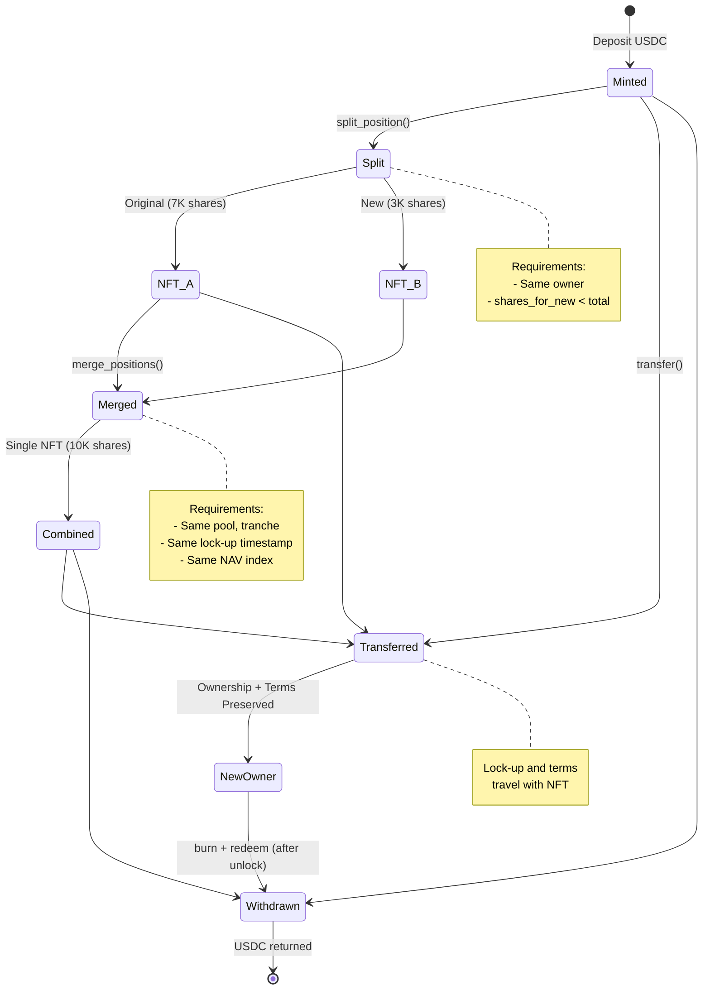

## Overview

**Position NFTs** are the tokenized representation of a liquidity provider's stake in a Kach pool. They are fully transferable ERC-721-style NFTs that encode all information needed to calculate a depositor's share of principal and yield at any point in time.

Unlike simple pool tokens, Position NFTs capture:
- Specific tranche membership (Senior or Junior)
- Share count in that tranche
- Lock-up period and unlock timestamp
- [NAV](/glossary#nav) index at creation (for yield calculation)
- Asset type (USDC, USDT, etc.)

## Why Position NFTs?

### Traditional Pool Tokens vs. Position NFTs

**Traditional Pool Tokens** (like Uniswap LP tokens):
- Fungible (all tokens identical)
- No lock-up periods
- No risk segregation
- Pro-rata share only

**Position NFTs** (Kach approach):
- Non-fungible (each unique)
- Embedded lock-up periods
- Tranche-specific risk/return
- Advanced operations (split, merge)
- Transferable with restrictions intact
- Secondary market friendly

### Key Benefits

**For Liquidity Providers**:
- Ownership clarity (specific NFT = specific claim)
- Portability (transfer or sell with restrictions intact)
- Flexibility (split position for partial exit)
- Composability (merge positions to consolidate)
- Transparency (all terms visible in NFT metadata)

**For the Protocol**:
- Lock-up enforcement (encoded in NFT, travels with transfers)
- Tranche segregation (clear risk boundaries)
- Accurate accounting ([NAV](/glossary#nav) index tracking)
- Secondary market support (NFTs naturally tradeable)

**For Ecosystem**:
- Lending collateral (use position as DeFi collateral)
- Structured products (bundle positions into new instruments)
- Portfolio management (easier tracking and rebalancing)

## Position NFT Structure

Each Position NFT contains the following metadata:

- **pool_addr**: Address of the specific pool (e.g., USDC pool)
- **tranche**: 0=Senior, 1=Junior
- **shares**: Share count in this tranche
- **nav_index_at_creation**: [NAV](/glossary#nav) multiplier when created
- **lock_until_timestamp**: Cannot redeem before this time
- **created_at**: Creation timestamp

### Field Details

**pool_addr**:
- Address of the specific pool (e.g., USDC pool)
- Ensures NFT can only be redeemed in correct pool
- Type safety via phantom type parameter `<FA>`

**tranche**:
- `0` = Senior (lower risk, 20% max loss, lower yield share)
- `1` = Junior (higher risk, 80% max loss, higher yield share)

**shares**:
- Number of shares in the tranche
- Not dollars, but share units
- Value = shares × [NAV](/glossary#nav) multiplier

**nav_index_at_creation**:
- [NAV](/glossary#nav) multiplier when NFT was minted
- Scaled by 1e18 for precision
- Example: 1_000000000000000000 = 1.0 (no yield yet)
- Used to calculate accrued yield at redemption

**lock_until_timestamp**:
- Unix timestamp (seconds since epoch)
- Position cannot be redeemed before this time
- Transfers are still allowed (lock travels with NFT)
- Can be 0 for no lock-up

**created_at**:
- Timestamp when position was created
- Used for analytics and lock-up calculation

## Minting Position NFTs

When a liquidity provider deposits, they receive a Position NFT.

**Process**:
1. Depositor transfers stablecoins to pool
2. Pool calculates shares based on current [NAV](/glossary#nav):
   - `shares = amount / current_nav_multiplier`
3. Position NFT minted to depositor with:
   - Pool address
   - Selected tranche (0=Senior, 1=Junior)
   - Calculated shares
   - Current [NAV](/glossary#nav) index
   - Lock-up timestamp (now + lock_duration)
   - Creation timestamp (now)

**Example**:
- Deposit: 10,000 USDC into Junior tranche
- Current [NAV](/glossary#nav): 1.05 (5% yield accrued)
- Shares issued: 10,000 / 1.05 = 9,523.81 shares
- Lock-up: 90 days
- NFT minted with: tranche=1, shares=9523.81, nav_index=1.05, lock_until=now+7776000

## Transferring Position NFTs

Position NFTs are **fully transferable** using standard NFT transfer functions:

**What Travels with Transfer**:
- All position details (tranche, shares, [NAV](/glossary#nav) index)
- Lock-up period (new owner must wait until unlock)
- Yield accrued (new owner gets accumulated yield)
- Risk exposure (new owner inherits tranche risk)

**Use Cases**:
- Gifting positions
- Selling on secondary market
- Using as collateral (transfer to lending protocol)
- Portfolio rebalancing
- Estate planning

**Important**: The lock-up restriction travels with the NFT. If you buy a position with 60 days remaining lock-up, you must wait 60 days to redeem.

## Position NFT Operations Overview



## Splitting Position NFTs

The **split** operation divides one Position NFT into two, enabling partial exits or portfolio diversification.

**Process**:
1. Verify owner owns the position
2. Verify `shares_for_new < total shares` (can't split all)
3. Create new Position NFT with:
   - Same pool, tranche, [NAV](/glossary#nav) index, lock-up timestamp
   - `shares = shares_for_new`
4. Update original Position NFT:
   - `shares = shares - shares_for_new`
5. New NFT minted to owner

**Example**:

**Before Split**:
- Position NFT #123
- Shares: 10,000
- Tranche: Junior
- Lock until: Jan 1, 2026
-- [NAV](/glossary#nav) index: 1.05

**After Split** (split 3,000 shares to new NFT):
- Position NFT #123 (original)
  - Shares: 7,000
  - Other fields unchanged

- Position NFT #456 (new)
  - Shares: 3,000
  - Same tranche, lock-up, [NAV](/glossary#nav) index

**Use Cases**:

1. **Partial Exit**:
   - Split position
   - Transfer one NFT to someone willing to wait lock-up
   - Keep other for future redemption

2. **Gifting Partial Position**:
   - Split to create gift-sized position
   - Transfer new NFT to recipient
   - Keep remainder

3. **Risk Management**:
   - Split position across multiple wallets
   - Diversify custody risk

4. **Collateral Optimization**:
   - Split to size perfectly for lending protocol
   - Keep remainder for other uses

5. **Portfolio Rebalancing**:
   - Split before selling portion on secondary market

**Restrictions**:
- Cannot split if result would create position with 0 shares
- Must be owner of position
- Position must exist and not be locked for operations

## Merging Position NFTs

The **merge** operation combines two compatible Position NFTs into one.

**Compatibility Requirements**:
Both positions must have:
- Same pool address
- Same tranche
- Same unlock timestamp
- Same asset type (enforced by `<FA>`)

**Process**:
1. Verify owner owns both positions
2. Verify positions are compatible
3. Calculate combined shares:
   - `total_shares = position1.shares + position2.shares`
4. Calculate weighted [NAV](/glossary#nav) index:
   - `merged_nav = (p1.shares × p1.nav + p2.shares × p2.nav) / total_shares`
5. Update first position with combined data
6. Burn second position

**Example**:

**Before Merge**:
- Position NFT #100
  - Shares: 5,000
  - [NAV](/glossary#nav) index: 1.08
  - Tranche: Senior
  - Unlock: Mar 1, 2026

- Position NFT #200
  - Shares: 3,000
  - [NAV](/glossary#nav) index: 1.12
  - Tranche: Senior
  - Unlock: Mar 1, 2026

**After Merge**:
- Position NFT #100 (kept)
  - Shares: 8,000
  - [NAV](/glossary#nav) index: (5000×1.08 + 3000×1.12) / 8000 = 1.095
  - Tranche: Senior
  - Unlock: Mar 1, 2026

- Position NFT #200 (burned)

**Use Cases**:

1. **Consolidation**:
   - Merge multiple small positions
   - Easier tracking and management
   - Reduce wallet clutter

2. **Gas Optimization**:
   - Single redemption instead of multiple
   - Lower transaction costs

3. **Simplified Transfers**:
   - Merge before selling on secondary market
   - Single NFT easier to transact

4. **Collateral Requirements**:
   - Lending protocols may require minimum size
   - Merge to meet threshold

**Why NAV Weighting?**:
If two positions were created at different times, they have different [NAV](/glossary#nav) indices. The weighted average ensures neither position's yield is lost or unfairly distributed.

**Restrictions**:
- Must own both positions
- Positions must be compatible (same pool, tranche, unlock time)
- Cannot merge positions from different tranches
- Cannot merge if unlock times don't match

## Calculating Position Value

Position value = **shares × current [NAV](/glossary#nav) multiplier**

### Current Value

```move
// Pseudocode
current_nav = pool.get_current_nav_multiplier(tranche)
position_value = (shares * current_nav) / 1e18
```

**Example**:
- Shares: 10,000
- Current [NAV](/glossary#nav): 1.15 (scaled: 1_150000000000000000)
- Value: (10,000 × 1_150000000000000000) / 1e18 = **11,500 USDC**

### Accrued Yield

```move
// Yield since creation
yield = shares × (current_nav - nav_at_creation) / 1e18
```

**Example**:
- Shares: 10,000
- [NAV](/glossary#nav) at creation: 1.05
- Current [NAV](/glossary#nav): 1.15
- Yield: 10,000 × (1.15 - 1.05) = **1,000 USDC**
- Return: 10% (on initial ~10,500 USDC deposit)

## Redeeming Position NFTs

When the lock-up period expires, the owner can redeem their position.

**Process** (not fully implemented, see note below):
1. Verify owner owns position
2. Verify current time ≥ unlock timestamp
3. Calculate redemption amount:
   - `amount = shares × current_nav / 1e18`
4. Transfer stablecoins to owner
5. Burn Position NFT

**Restrictions**:
- Must be owner
- Must be past unlock timestamp
- Pool must have sufficient liquidity
- Pool must not be paused

**Note**: The redemption function exists but complete flow is not yet fully implemented in contracts. The burn function and value calculation logic are present, but final integration with pool withdrawal is pending.

## View Functions

Query position details without modifying state:

### Get Position Details

Returns position metadata:
- pool_addr
- tranche
- shares
- nav_index_at_creation
- lock_until_timestamp
- created_at

### Check if Redeemable

Returns true if current time ≥ unlock timestamp.

### Calculate Current Value

Returns current value in stablecoin units based on provided [NAV](/glossary#nav).

## Secondary Market Considerations

Position NFTs are designed to be traded:

### Pricing Factors

When buying/selling on secondary market:

1. **Time to Unlock**:
   - Longer lock = higher discount
   - Near unlock = closer to redemption value

2. **Tranche Risk**:
   - Junior = higher yield, higher risk, volatility in price
   - Senior = lower yield, stable price

3. **Accrued Yield**:
- Higher [NAV](/glossary#nav) index = more yield already earned
   - Buyer captures future yield only

4. **Pool Health**:
   - Pool utilization
   - Default rates
   - Attestator quality

5. **Market Conditions**:
   - Stablecoin yields elsewhere
   - DeFi rate environment
   - Liquidity premium

### Example Pricing

**Position Details**:
- 10,000 shares, Junior tranche
- Current value: 11,500 USDC (15% yield accrued)
- Lock-up: 45 days remaining
- Pool: Healthy, 70% utilization, 0.5% defaults

**Potential Secondary Price**:
- Base value: 11,500 USDC
- Lock-up discount: -5% (45 days) = -575 USDC
- Junior risk premium: +2% = +230 USDC
- Market price: ~11,155 USDC

Seller gets liquidity now, buyer gets discount for waiting.

## Advanced Use Cases

### 1. Using as Collateral

Position NFTs can collateralize loans in DeFi lending protocols:

```solidity
// Example: Lend against Position NFT
1. Transfer NFT to lending protocol
2. Borrow up to 70% of redemption value
3. Repay loan + interest before unlock
4. Reclaim NFT and redeem
```

**Benefits**:
- Liquidity without losing position
- Leverage stablecoin yield
- Tax-efficient (no sale event)

### 2. Yield Farming

Combine positions with other DeFi protocols:

- Use Junior position for high yield
- Deposit redemption value in yield farm
- Stack yields from both sources
- Manage leverage and risk carefully

### 3. Estate Planning

Position NFTs simplify inheritance:

- Transfer to beneficiary wallet
- Lock-up and yield travel with transfer
- Clear ownership record on-chain
- No protocol-specific migration needed

### 4. Portfolio Construction

Build sophisticated portfolios:

- Split large position into multiple
- Diversify across tranches
- Different unlock times for liquidity ladder
- Transfer to multi-sig for DAO treasury

### 5. Options and Derivatives

Build structured products:

- Sell call option on Junior position (high volatility)
- Create principal-protected note (Senior + option)
- Tranche-specific yield swaps
- Fixed-to-floating rate conversions

## Technical Implementation

### Key Contract References

**Module**: `position_nft.move`

**Key Functions**:
- `mint_position<FA>()`: Create new position (called by pool)
- `split_position<FA>()`: Divide position into two
- `merge_positions<FA>()`: Combine compatible positions
- `burn_position<FA>()`: Destroy position (redemption)
- `get_position_details<FA>()`: Query position data

**Events Emitted**:
- `PositionMinted`: position_addr, owner, pool, tranche, shares, nav_index
- `PositionSplit`: original_addr, new_addr, original_shares, new_shares
- `PositionsMerged`: kept_addr, burned_addr, total_shares, merged_nav
- `PositionRedeemed`: position_addr, owner, shares, amount_redeemed

## Best Practices

### For Liquidity Providers

**When Depositing**:
1. Choose tranche based on risk tolerance
2. Select lock-up period carefully (longer may have benefits in future)
3. Consider splitting deposit across tranches
4. Note [NAV](/glossary#nav) at creation for yield tracking

**Managing Positions**:
1. Monitor pool health and utilization
2. Track maturity dates for planning
3. Use splits for partial liquidity needs
4. Merge similar positions to simplify

**Before Transferring**:
1. Verify buyer understands lock-up restriction
2. Price in time-to-unlock discount
3. Check pool health for accurate valuation
4. Document any off-chain agreements

### For Developers

**Integrating Position NFTs**:
1. Use view functions for state queries
2. Subscribe to events for updates
3. Implement [NAV](/glossary#nav) calculation correctly
4. Handle type parameters `<FA>` properly
5. Respect lock-up restrictions in UI

**Building Secondary Markets**:
1. Display all relevant position metadata
2. Calculate and show time to unlock
3. Provide tranche risk explanations
4. Show pool health metrics
5. Implement pricing models that account for lock-up

## Future Enhancements

**Planned Features**:
1. **Lock-up Yield Multipliers**: Longer lock-ups earn higher yield
2. **Redemption Queue**: Fair distribution when pool liquidity low
3. **Partial Redemption**: Redeem portion of position without split
4. **Auto-compound**: Automatically reinvest yield into position
5. **Cross-Pool Transfers**: Move positions between asset pools
6. **Position Limit Orders**: Set automatic sale price for secondary market
7. **Streaming Redemption**: Vest redemption over time period

**Under Research**:
- Fractional NFTs (ERC-404 style)
- Position options (calls/puts on redemption value)
- Automated market maker for position liquidity
- Position insurance (protect against tranche losses)

## Related Documentation

- [Tranches & Risk Layers](/tranches): Understanding risk/return profiles
- [Pool Mechanics](/architecture): How pools manage liquidity
- [Lifecycle](/lifecycle): Full user journey including deposits
- [Glossary - Position NFT](/glossary#position-nft): Quick reference
