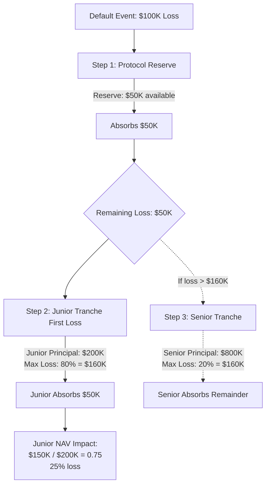

### Motivation

Not all depositors have the same risk appetite. Some want stable, lower yields and stronger protection in stressed scenarios. Others are willing to absorb more risk in exchange for higher returns.

Kach addresses this by offering **two [tranches](/glossary#tranche) per pool** (senior and junior) and encoding the [tranche](/glossary#tranche) choice directly on each LP's [Position NFT](/glossary#position-nft) rather than issuing separate [tranche](/glossary#tranche) tokens. [Tranche](/glossary#tranche) metadata drives loss waterfalls, yield multipliers, and unlock logic, so secondary buyers cannot misrepresent their risk exposure; the NFT always discloses the layer it belongs to.

-   **Senior Tranche**

    -   Lower risk, lower yield.

    -   Last to take losses in case of Attestator defaults.

    -   Receives interest after the junior tranche has received its risk-adjusted share, subject to parameters.

-   **Junior Tranche**

    -   Highest risk, highest yield.

    -   First-loss capital in case of Attestator defaults.

    -   In a default scenario, junior holders see the largest proportional hit to their pool share, consistent with their higher reward.

### Loss waterfall (conceptual)

In a default event where an Attestator fails to repay:

**Example Scenario: $100K Default on $1M Pool**

- **Gross Loss**: $100,000
- **Step 1**: Protocol Reserve absorbs $50K (depleted)
- **Step 2**: Junior tranche absorbs remaining $50K
  - Junior principal: $200K → Loss: $50K (25% of junior capital)
  - Junior NAV: 1.0 → 0.75
- **Step 3**: Senior tranche unaffected (loss absorbed by junior)
  - Senior NAV: 1.0 (no impact)

1.  The protocol calculates the net realized loss after any recoveries.

2.  Losses are allocated in the following order:

    -   First to the **Junior** tranche, up to 80% of junior principal.

    -   Then to the **Senior** tranche up to 20%, if losses exceed the junior cushion.

3.  Within each [tranche](/glossary#tranche), losses are shared pro rata according to the share counts and [NAV](/glossary#nav) multipliers encoded in each [Position NFT](/glossary#position-nft), so accounting and redemption amounts can be independently verified from on-chain metadata.

Yield works in the opposite direction:

-   Junior earns the highest base rate plus incentives.

-   Senior earns the lowest but most stable yield, buffered by the junior tranche.

Exact percentages, spreads between tranches, and potential reserve layers can be configured by governance over time.

### Initial parameter baselines

Numbers below are the current working defaults for testnet and the planned mainnet alpha. They are governance-controlled and will be tuned once real performance data arrives.

| Parameter | Default | Notes |
| --- | --- | --- |
| Target utilization band | 60–80% | Keeps headroom for withdrawals and Attestator draws. |
| Deposit cap (per pool) | $10–25m during alpha | Raised only after clean repayment history and audit sign-off. |
| Tenor bands | Standard 1–5 days; prefund/extended fixed 7/14/30/60/90 days | Longer tenors gated to top Trust Scores with additional guarantees. |
| Capital weighting multipliers | Senior 0.8×, Junior 1.3× | Used for risk-adjusted interest distribution; governance-tunable. |
| Reserve skim | 5–10% of gross interest | Funds protocol reserves before tranche distribution. |
| Loss waterfall caps | Junior first-loss up to 80% of its principal, Senior up to 20% | Caps can tighten or loosen per pool. |
| Concentration limits | Max 25–30% exposure to any single Attestator or corridor | Enforced at underwriting and draw time. |

Calculating yield distribution:

1. Receive interest from Attestator repayments.
2. Deduct protocol fee (7% of gross interest).
3. Calculate capital-weighted shares:
   - Senior weight = `senior_deposits × 0.8`
   - Junior weight = `junior_deposits × 1.3`
   - Total weight = senior weight + junior weight
4. Distribute remaining interest proportionally:
   - Senior receives: `(interest_after_fee) × (senior_weight / total_weight)`
   - Junior receives: `(interest_after_fee) × (junior_weight / total_weight)`
5. Update [NAV](/glossary#nav) for each tranche based on distributed yield.

**Example with $100M pool ($80M Senior, $20M Junior):**
- Gross interest received: $1,000
- Protocol fee (7%): $70 → leaves $930
- Senior weight: $80M × 0.8 = 64M
- Junior weight: $20M × 1.3 = 26M
- Total weight: 90M
- Senior gets: $930 × (64/90) = **$660** → 0.825% yield on $80M
- Junior gets: $930 × (26/90) = **$270** → 1.35% yield on $20M

**Result:** Junior earns ~1.64× more per dollar (1.35% ÷ 0.825%) to compensate for first-loss risk.

These parameters are encoded on-chain per pool and can be versioned so historical Position NFTs always reference the rule set in effect when they were minted.
