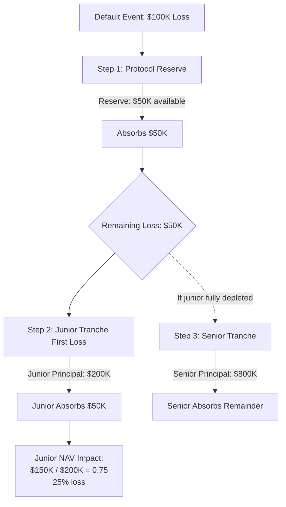

import { Step, Steps } from 'fumadocs-ui/components/steps';

### Motivation

Not all depositors have the same risk appetite. Some want stable, lower yields and stronger protection in stressed scenarios. Others are willing to absorb more risk in exchange for higher returns.

Kach addresses this by offering **two [tranches](/glossary#tranche) per pool** (senior and junior) and encoding the [tranche](/glossary#tranche) choice directly on each LP's [Position NFT](/glossary#position-nft) rather than issuing separate [tranche](/glossary#tranche) tokens. [Tranche](/glossary#tranche) metadata drives loss waterfalls, yield multipliers, and unlock logic, so secondary buyers cannot misrepresent their risk exposure; the NFT always discloses the layer it belongs to.

-   **Senior Tranche**

    -   Lower risk, lower yield.

    -   Last to take losses in case of Attestator defaults.

    -   Receives interest after the junior tranche has received its risk-adjusted share, subject to parameters.

-   **Junior Tranche**

    -   Highest risk, highest yield.

    -   First-loss capital in case of Attestator defaults.

    -   In a default scenario, junior holders see the largest proportional hit to their pool share, consistent with their higher reward.

### Loss waterfall (conceptual)

In a default event where an Attestator fails to repay:

**Example Scenario: 100K Default on $1M Pool**

<Steps>
  <Step title="Gross loss: $100,000">
    Baseline loss to allocate after any recoveries.
  </Step>
  <Step title="Reserve takes first $50K">
    Protocol reserve absorbs half the loss and is depleted.
  </Step>
  <Step title="Junior absorbs remaining $50K">
    Junior principal: $200K → Loss: $50K (25% of junior capital); Junior NAV: 1.0 → 0.75.
  </Step>
  <Step title="Waterfall order">
    Losses hit junior first until depleted, then senior if needed.
  </Step>
  <Step title="Pro-rata within each tranche">
    Losses share pro rata by each Position NFT’s shares and NAV so redemption math is independently verifiable.
  </Step>
  <Step title="Senior unaffected in this scenario">
    Junior coverage is sufficient, so senior NAV stays at 1.0.
  </Step>
</Steps>

Yield works in the opposite direction:

-   Junior earns the highest base rate plus incentives.

-   Senior earns the lowest but most stable yield, buffered by the junior tranche.

Exact percentages, spreads between tranches, and potential reserve layers can be configured by governance over time.

### Initial parameter baselines

Numbers below are the current working defaults for testnet and the planned mainnet alpha. They are governance-controlled and will be tuned once real performance data arrives.

| Parameter | Default | Notes |
| --- | --- | --- |
| Target utilization band | 60–80% | Keeps headroom for withdrawals and Attestator draws. |
| Deposit cap (per pool) | $10–25m during alpha | Raised only after clean repayment history and audit sign-off. |
| Tenor bands | Standard 1–5 days; prefund/extended fixed 7/14/30/60/90 days | Longer tenors gated to top Trust Scores with additional guarantees. |
| Base risk premium | 0.3 (30%) | Governance-tunable parameter used in dynamic yield calculation to adjust risk compensation. |
| Reserve skim | 5–10% of gross interest | Funds protocol reserves before tranche distribution. |
| Loss waterfall order | Reserve → Junior first-loss until depleted → Senior next | Applies after protocol reserve is exhausted. |
| Concentration limits | Max 25–30% exposure to any single Attestator or corridor | Enforced at underwriting and draw time. |

Calculating yield distribution:

1. Receive interest from Attestator repayments.
2. Deduct protocol fee (7% of gross interest).
3. **Calculate dynamic capital-weighted multipliers** based on actual pool composition:
   - **Protection ratio** = `senior_deposits / junior_deposits` (how many dollars of senior each junior dollar protects)
   - **Junior multiplier** = `1.0 + (protection_ratio × base_risk_premium)`
   - **Senior multiplier** = `1.0 - (junior_deposits / senior_deposits × base_risk_premium)`
   - Where `base_risk_premium` = 0.3 (governance parameter)
4. Calculate weighted shares:
   - Senior weight = `senior_deposits × senior_multiplier`
   - Junior weight = `junior_deposits × junior_multiplier`
   - Total weight = senior weight + junior weight
5. Distribute remaining interest proportionally:
   - Senior receives: `(interest_after_fee) × (senior_weight / total_weight)`
   - Junior receives: `(interest_after_fee) × (junior_weight / total_weight)`
6. Update [NAV](/glossary#nav) for each tranche based on distributed yield.

**Example with $100M pool ($80M Senior, $20M Junior):**

<Steps>
  <Step title="Collect $1,000 interest, skim $70 fee">
    Protocol keeps 7%, leaving $930 for LPs.
  </Step>
  <Step title="Compute protection ratio and multipliers">
    Protection ratio: 4.0. Junior multiplier: 2.2. Senior multiplier: 0.925.
  </Step>
  <Step title="Weight capital by multipliers">
    Senior weight: 74M. Junior weight: 44M. Total: 118M.
  </Step>
  <Step title="Distribute interest">
    Senior receives $930 × (74/118) = $583 (0.729% on $80M); Junior receives $930 × (44/118) = $347 (1.735% on $20M).
  </Step>
</Steps>

**Result:** Junior earns ~2.38× more per dollar (1.735% ÷ 0.729%) to compensate for first-loss risk.

**Example with more balanced $100M pool ($50M Senior, $50M Junior):**

<Steps>
  <Step title="Collect $1,000 interest, skim $70 fee">
    Protocol keeps 7%, leaving $930 for LPs.
  </Step>
  <Step title="Compute protection ratio and multipliers">
    Protection ratio: 1.0. Junior multiplier: 1.3. Senior multiplier: 0.7.
  </Step>
  <Step title="Weight capital by multipliers">
    Senior weight: 35M. Junior weight: 65M. Total: 100M.
  </Step>
  <Step title="Distribute interest">
    Senior receives $930 × (35/100) = $326 (0.651% on $50M); Junior receives $930 × (65/100) = $605 (1.209% on $50M).
  </Step>
</Steps>

**Result:** Junior earns ~1.86× more per dollar (1.209% ÷ 0.651%). The premium is lower because risk is more evenly distributed.

**Rationale for dynamic multipliers:** As junior becomes a smaller percentage of the pool, they protect proportionally more senior capital and bear greater concentration risk, so they automatically receive higher yield compensation. This creates fair risk-adjusted returns that adapt to actual pool composition rather than using static multipliers.

These parameters are encoded on-chain per pool and can be versioned so historical Position NFTs always reference the rule set in effect when they were minted.
