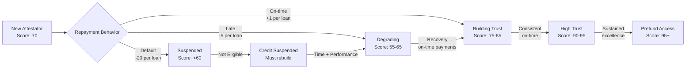

## Overview

Every Attestator (borrower) has a **Trust Score** that governs credit access and draw capabilities. The score blends **amount-weighted behavior**, **count-based reliability**, **recency decay**, and **anti-gaming limits** so reputation scales with real volume, not just payment counts.



**Key Thresholds**:
- **≥ 95**: Prefund draw access (no upfront attestation required)
- **≥ 60**: Standard draw access (attestation required)
- **< 60**: Credit suspended until recovery

### Data Tracked
- `good_volume`: Sum of amounts repaid on time (decayed over time)
- `late_volume`: Sum of amounts repaid late (decayed, severity-weighted)
- `default_volume`: Sum of defaulted amounts (decayed, higher severity)
- `on_time_count`, `late_count`, `default_count`: Event counts
- `total_loans`: Total loans ever drawn
- `effective_amount` per loan: `loan_amount^p` to smooth very large draws (concave if `p < 1`)
- `last_update`: Timestamp for applying decay

### Core Mechanics
1. **Per-loan weighting**: Each loan contributes `loan_amount^p`, where `p < 1` reduces outsized influence of very large draws; `p = 1` is linear; `p = 0` collapses to pure counts.
2. **Amount-weighted scoring**: Repayments update `good_volume`, `late_volume`, and `default_volume` using the weighted amount.
3. **Severity multipliers**: Late volume is multiplied by `w_late`; default volume by `w_default > w_late` to amplify negative behavior.
4. **Recency decay**: At each update, all volumes are multiplied by `decay_factor < 1` so recent performance dominates.
5. **Hybrid score**: Combine a volume-based score with a count-based score:
   - `volume_score = base - (w_late * late_volume + w_default * default_volume) / (good_volume + epsilon)`
   - `count_score` mirrors the same idea using counts
   - `final_score_raw = a * volume_score + b * count_score`
6. **Confidence multiplier**: Scale by `confidence = f(total_loans)` (e.g., logarithmic growth) so deeper histories stabilize scores:
   - `final_score = final_score_raw * confidence`
7. **Anti-gaming limit rule**: A borrower’s `max_loan_amount` is bounded by `k * good_volume` (or the decayed equivalent), preventing tiny-loan farming before requesting a very large draw.
8. **No hard caps / permanent scars**: Defaults hurt via severity and decay-adjusted volume, but recovery is always possible with sustained on-time, material repayments.

### Calculation Flow

```
on_repayment(loan_amount, status, now):
    // 1) Per-loan weighting (concave if p < 1)
    eff = loan_amount ^ p

    // 2) Apply recency decay to history
    dt = now - last_update
    decay = decay_factor ^ (dt / decay_interval)
    good_volume    *= decay
    late_volume    *= decay
    default_volume *= decay

    // 3) Update volumes and counts
    if status == ON_TIME:
        good_volume  += eff
        on_time_count += 1
    else if status == LATE:
        late_volume  += eff
        late_count   += 1
    else if status == DEFAULT:
        default_volume += eff
        default_count  += 1

    total_loans += 1
    last_update = now

compute_scores():
    // 4) Amount-weighted scoring with severity
    weighted_bad = w_late * late_volume + w_default * default_volume
    volume_score = clamp( base - weighted_bad / (good_volume + epsilon), 0, 100 )

    // 5) Count-based scoring
    weighted_bad_counts = w_late * late_count + w_default * default_count
    count_score = clamp( base - weighted_bad_counts / (on_time_count + epsilon), 0, 100 )

    // 6) Confidence multiplier (history depth)
    confidence = f(total_loans)  // e.g., 1 + log(1 + total_loans) / c

    // 7) Combine
    final_score_raw = a * volume_score + b * count_score
    final_score = clamp( final_score_raw * confidence, 0, 100 )

max_loan_amount = k * good_volume  // anti-gaming sizing gate
```

> Parameters `p`, `w_late`, `w_default`, `decay_factor`, `a`, `b`, `k`, and the confidence function are governance-tunable. Defaults lean conservative for launch.

### Rationale
- **Amount-weighting**: Reputation scales with dollars repaid, not just payment counts.
- **Severity multipliers**: Late vs. default are distinct risks; defaults penalize harder.
- **Recency decay**: Recent behavior matters most; old issues fade if performance improves.
- **Hybrid volume + count**: Volume captures economic exposure; counts capture behavioral consistency and smooth sparsity.
- **Confidence factor**: More history stabilizes scores; thin histories remain volatile.
- **Per-loan concave weighting**: Prevents a single jumbo repayment from overpowering the history; still rewards larger, timely flows.
- **Anti-gaming size gate**: Forces borrowers to earn access to larger tickets by repaying comparable volume first.
- **No permanent scarring**: Recovery is possible through sustained, meaningful repayments.

### Architecture Diagram (text)

```
        ┌─────────────────┐
        │  Loan Repayment │
        └───────┬─────────┘
                │
        ┌───────▼─────────┐
        │ Per-loan weight │  (loan_amount^p)
        └───────┬─────────┘
                │
        ┌───────▼─────────┐
        │ Apply Decay     │  (good/late/default volumes)
        └───────┬─────────┘
                │
        ┌───────▼─────────┐
        │ Update Volumes  │  (severity multipliers)
        └───────┬─────────┘
                │
        ┌───────▼─────────┐
        │ Volume Score    │
        └───────┬─────────┘
                │
        ┌───────▼─────────┐
        │ Count Score     │
        └───────┬─────────┘
                │
        ┌───────▼─────────┐
        │ Confidence f(n) │
        └───────┬─────────┘
                │
        ┌───────▼─────────┐
        │ Combine (a,b)   │ → Final Trust Score
        └─────────────────┘
```

### Thresholds
- **≥ 60**: Eligible for standard PRT draws (with attestation)
- **≥ 95**: Eligible for prefund draws (no upfront attestation)
- **< 60**: Credit access suspended until score recovers

### Anti-Gaming Loan Sizing
- `max_loan_amount = k * good_volume` (using decayed good_volume)
- Large draws only allowed after repaying comparable, recent volume on time.

### Pseudocode (TypeScript-style sketch)

```ts
function updateTrust(state, loanAmount, status, now) {
  const eff = Math.pow(loanAmount, state.p);
  const dt = now - state.lastUpdate;
  const decay = Math.pow(state.decayFactor, dt / state.decayInterval);

  state.goodVolume    *= decay;
  state.lateVolume    *= decay;
  state.defaultVolume *= decay;

  if (status === "on_time") state.goodVolume += eff;
  if (status === "late")     state.lateVolume += eff;
  if (status === "default")  state.defaultVolume += eff;

  if (status === "on_time") state.onTimeCount += 1;
  if (status === "late")     state.lateCount += 1;
  if (status === "default")  state.defaultCount += 1;

  state.totalLoans += 1;
  state.lastUpdate = now;
}

function computeTrust(state) {
  const weightedBadVol = state.wLate * state.lateVolume + state.wDefault * state.defaultVolume;
  const volumeScore = clamp(
    state.base - weightedBadVol / (state.goodVolume + state.epsilon),
    0, 100
  );

  const weightedBadCount = state.wLate * state.lateCount + state.wDefault * state.defaultCount;
  const countScore = clamp(
    state.base - weightedBadCount / (state.onTimeCount + state.epsilon),
    0, 100
  );

  const confidence = state.confidenceFn(state.totalLoans); // e.g., 1 + Math.log(1 + totalLoans)/c
  const raw = state.a * volumeScore + state.b * countScore;
  const final = clamp(raw * confidence, 0, 100);

  const maxLoanAmount = state.k * state.goodVolume; // anti-gaming size gate

  return { final, volumeScore, countScore, confidence, maxLoanAmount };
}
```

### Implementation Notes (Move sketch)

```move
// Pseudocode-level sketch; actual storage omitted for brevity.
fun apply_repayment(
    state: &mut TrustState,
    loan_amount: u64,
    status: u8,
    now: u64,
    params: &TrustParams
) {
    let eff = pow_u64(loan_amount, params.p);
    let dt = now - state.last_update;
    let decay = pow_fp(params.decay_factor, dt / params.decay_interval);

    state.good_volume    = (state.good_volume * decay);
    state.late_volume    = (state.late_volume * decay);
    state.default_volume = (state.default_volume * decay);

    if (status == STATUS_ON_TIME) {
        state.good_volume = state.good_volume + eff;
        state.on_time_count = state.on_time_count + 1;
    } else if (status == STATUS_LATE) {
        state.late_volume = state.late_volume + eff;
        state.late_count = state.late_count + 1;
    } else if (status == STATUS_DEFAULT) {
        state.default_volume = state.default_volume + eff;
        state.default_count = state.default_count + 1;
    };

    state.total_loans = state.total_loans + 1;
    state.last_update = now;
}
```
