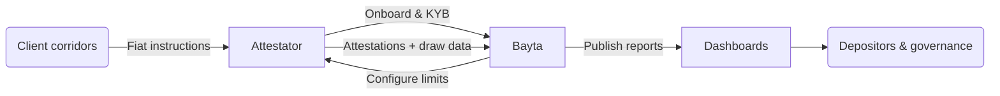

## Current status

- Kach is in the **design and early implementation phase**.
- [Smart contracts](https://github.com/KachFlow/kach) are being developed on Aptos and will undergo **audits with support from the Aptos Foundation** before mainnet deployment.
- Initial pilots will be run with a small set of partners in high-need corridors across **Africa, [LATAM](/glossary#latam), and [APAC](/glossary#apac)**.

## Milestone overview

| Phase | Objective | Exit criteria |
| --- | --- | --- |
| Testnet MVP | Deploy KachFlow, [Position NFTs](/glossary#position-nft), and PRT modules with a handful of Attestators using sandbox funds. | Successful dry-runs of draw/repay flows, reporting pipeline validated. |
| Security audit | Complete Move audits and remediation rounds. | Auditor sign-off, bug fixes, and on-chain invariants documented. |
| Mainnet alpha | Enable capped USDC deposits and 1-2 Attestators under [Bayta](/glossary#bayta)-operated controls. | Stable operations over multiple credit cycles and published transparency reports. |
| Cross-chain intake | Add bridged deposits and tooling for non-Aptos LPs. | Bridge risk controls accepted by governance, liquidity arriving from target chains. |

## Zero-knowledge attestations (in exploration)

Aptos has begun publishing zk verifier tooling, and we are exploring how to incorporate those primitives into the attestation pipeline so Attestators can prove fiat legs without revealing client data. The effort is in research mode: we are validating the performance, costs, and operational workflows (including potential off-chain fallback verifiers) before committing to an implementation timeline. Updates will follow once that work is complete.

## Pilot focus

- **Single-fintech partnership**: Kach’s near-term deployment centers on one deeply integrated Attestator that already runs high-friction corridors across **Africa, [LATAM](/glossary#latam), and [APAC](/glossary#apac)**. [Bayta](/glossary#bayta) works shoulder to shoulder with this partner, configuring corridor-specific caps, iterating on attestation payloads, and validating reporting requirements in production. The flow below illustrates the tight feedback loop.

## Dependencies

- Successful audits and remediation.
- Partner feedback.
- Pilot performance ([utilization](/glossary#utilization), loss ratios, repayment discipline).
- Market conditions.
