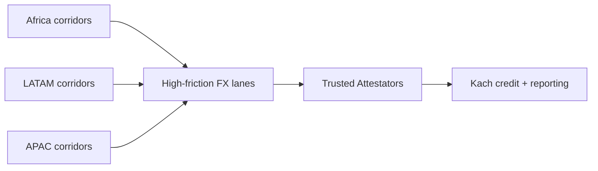

## Rollout priorities

- **Africa**: NGN, KES, GHS, and ZAR payouts where onshore USD liquidity is constrained.
- **LATAM**: BRL, MXN corridors where fintechs already use stablecoins for settlements.
- **APAC**: INR, IDR, PHP markets with fast-growing e-commerce and remittance flows.

## Product milestones

1. **MVP**: [KachFlow contracts](https://github.com/KachFlow/kach) live on Aptos testnet with pilot Attestators.
2. **Audit & mainnet**: Complete third-party Move audits before enabling USDC deposits.
3. **Reporting**: Release public dashboards showing [utilization](/glossary#utilization), Trust Scores, and realized yield.
4. **Cross-chain access**: Add bridges/routers to collect stablecoins from other chains while keeping accounting on Aptos.

## Go-to-market pillars

- **Regulated supply**: Work with Attestators that already hold [MSB](/glossary#msb)/[EMI](/glossary#emi)/[PSP](/glossary#psp) licenses so Kach can stay permissionless for depositors.
- **Data transparency**: Every draw, repayment, and limit change emits structured events, enabling real-time risk monitoring for [Bayta](/glossary#bayta), Attestators, and LPs.
- **Operational tooling**: Provide APIs and attestation templates so Attestators can integrate quickly without bespoke engineering.
- **Regional partners**: Pair [Bayta](/glossary#bayta)’s underwriting team with local advisors to maintain policy coverage in each jurisdiction.
