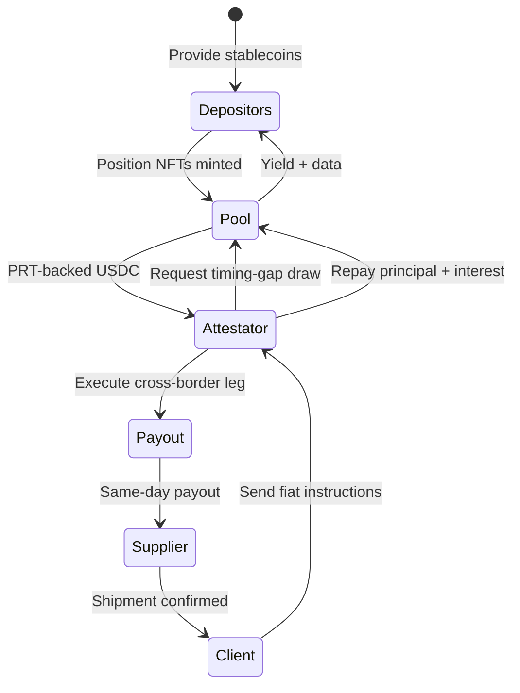

> **Start here if you're new.** This page gives the thesis in one glance. When you're ready for the story behind the numbers, continue with the [Introduction](/introduction).

Global cross-border payments already move well over USD 190 trillion each year, and most analysts expect another decade of roughly 5% annual growth.<a href="/references#ref-11">[11]</a><a href="/references#ref-14">[14]</a> Yet the industry still leans on pre-funded nostro/vostro accounts, daylight overdraft buffers, and fragmented local rails.<a href="/references#ref-15">[15]</a><a href="/references#ref-16">[16]</a><a href="/references#ref-17">[17]</a> Capital sits in dozens of jurisdictions simply to guarantee that a future payment can clear.

Kach unlocks that idle float. Depositors supply approved stablecoins (starting with USDC on Aptos) into asset-specific pools, earn yield from rapid **1–5 day** credit cycles (prefund/extended draws can use fixed 7/14/30/60/90-day tenors), and hold transferable NFT positions that encode [tranche](/glossary#tranche) and lock-up data. Licensed settlement providers, or **Attestators**, request credit, execute real-world payouts on behalf of their clients, and repay once fiat legs close. Clients never touch Kach directly.

[Bayta Co.](/glossary#bayta) operates the early network. The system launches without a token, and any future KACH allocation will only happen after the protocol meets [utilization](/glossary#utilization) and loss milestones. Liquidity remains permissionless, while Attestator access stays fully gated and underwritten.

### How Kach Works in 90 Seconds

- **Problem size**: Cross-border payouts consume trillions in idle float because providers pre-fund multiple rails “just in case.”
- **Liquidity supply**: Depositors bring stablecoins to Aptos pools, choose lock-ups and [tranches](/glossary#tranche), and earn yield that scales with [utilization](/glossary#utilization).
- **[Position NFTs](/glossary#position-nft)**: Every deposit mints a transferable NFT recording tranche, lock-up, and [NAV](/glossary#nav) data so rights travel with the holder.
- **Client demand**: Importers, exporters, and fintechs issue payout instructions to their Attestator and never interface with Kach.
- **Attestator settlement**: Licensed intermediaries ingest fiat, draw short-term credit, close corridors, and repay within days.
- **Credit cycle**: Limits are pre-approved, draws settle instantly, and repaid capital is redeployed on the next request.
- **Tokenized receivables**: Each draw mints a Payment Receivable Token (PRT) with principal, tenor, and Trust Score details until repayment.
- **Targets**: 60-80% [utilization](/glossary#utilization), 1–5 day operational duration (with prefund/extended draws on fixed 7/14/30/60/90-day tenors), disciplined loss ratios under 1%, and on-chain reporting for regulators and auditors.
